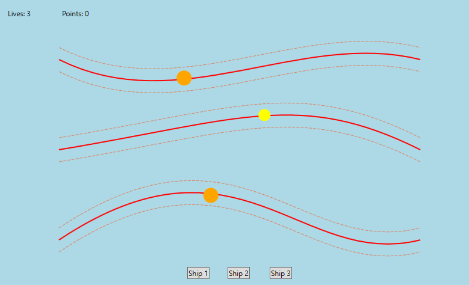
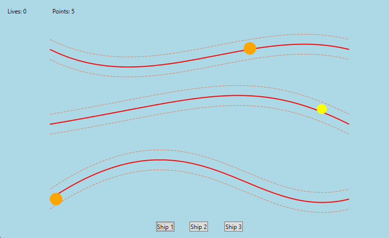

<a id="readme-top"></a>

<!-- PROJECT LOGO -->
<br />
<div align="center">
  <a href="https://github.com/hawwokitty/ship-game">
    
  </a>

<h3 align="center">Ship Game</h3>

  <p align="center">
    A thrilling and fast-paced game where you try to keep the ships on the right path and collecting points!
  </p>
</div>

<!-- ABOUT THE PROJECT -->
## About The Project
<p>The Ship Game is an exciting action game built using C# and WPF. The goal is to control multiple ships as they stay within a set range and collecting points. Ships are removed when they either finish their paths or get destroyed due to errors in navigation.</p>

### Built With

* C# (Main language)
* WPF (For the GUI)
* .NET Framework (For game logic and controls)
* System.Windows (For UI elements and rendering)

### Features
* Control multiple ships navigating different paths
* Ship removal mechanics: Ships are removed when they finish their paths or collide with obstacles
* Increasing difficulty with each new loop
* Real-time UI updates: Track lives, points, and ship status
* Unique ship types with different characteristics (cargo ship, oil tanker)

<!-- GETTING STARTED -->
## Getting Started

### Prerequisites

* Before running the game, ensure you have the necessary dependencies installed:
  ```sh
  Install-Package System.Windows.Forms
  Install-Package System.Windows.Media
  ```

### Installation

1. Clone the repo
   ```sh
   git clone https://github.com/hawwokitty/Ship-Game.git
   cd Ship-Game
   ```

2. Build and run the project
   Open the project in Visual Studio and build it. Once built, run the application by pressing `F5`.

### Controls
* **Buttons**: Remind the ship to get back on the right path. Each click sets them closer to the right path.

<!-- USAGE EXAMPLES -->
## Usage

Once the game is running, you can:
* Navigate ships along predefined paths
* Complete paths to gain points
* Track your score and lives at the top of the screen
* Challenge yourself to keep your ships intact and maintain your score

<div align="center">
    
</div>

### Ship Types
* **Cargo Ship**: A faster ship but with lower durability. 
* **Oil Tanker**: The slow-moving but resilient ship.
* **Special Ship**: A unique ship with enhanced abilities (coming soon).

<!-- FUTURE FEATURES -->
## Future Features
* Add new ship types with unique characteristics
* Implement power-ups to enhance ships' abilities
* Improve UI and ship animations


